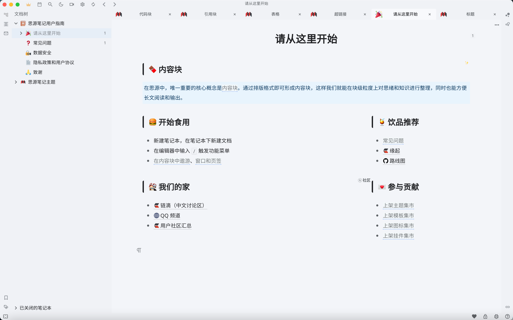
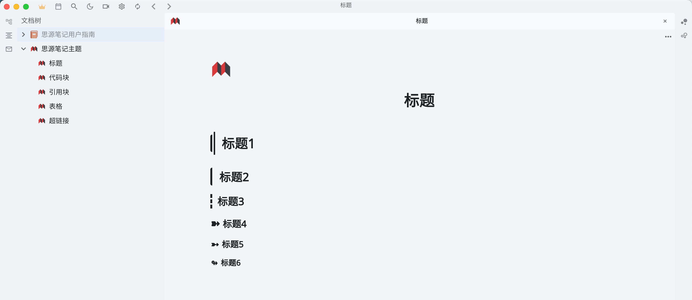
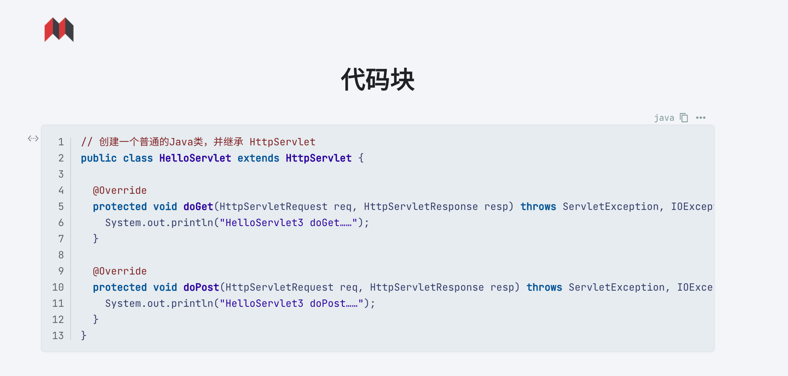
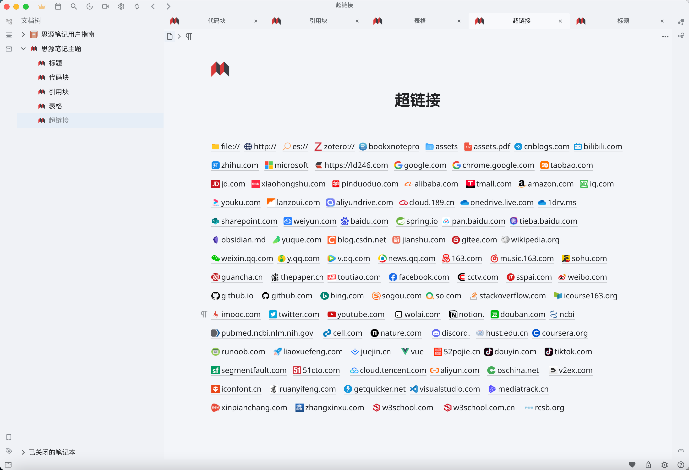

# Hazy Moonlight：A Theme for SiYuan

## 介绍

[思源笔记](http://github.com/siyuan-note/siyuan)的一款浅色主题。 
A light theme for [SiYuan](http://github.com/siyuan-note/siyuan)

整体采用融为一体的、朦胧、清爽的风格。

### 整体预览

### 标题样式

### 代码块样式

### 超链接样式

## 说明
因为思源笔记在不断更新版本，比如外观布局会有一些变化，我会尽可能跟进更新这个主题，在每个发布的版本处会标注在哪个版本的思源笔记上经过测试，即表明在所标注版本的思源笔记下使用最适配，否则则可能会出现一些问题。

## Reference

- [siyuan-gitbook-azure](https://github.com/yuuuxt/siyuan-gitbook-azure)
- [siyuan-themes-tsundoku-light](https://github.com/Achuan-2/siyuan-themes-tsundoku-light)

