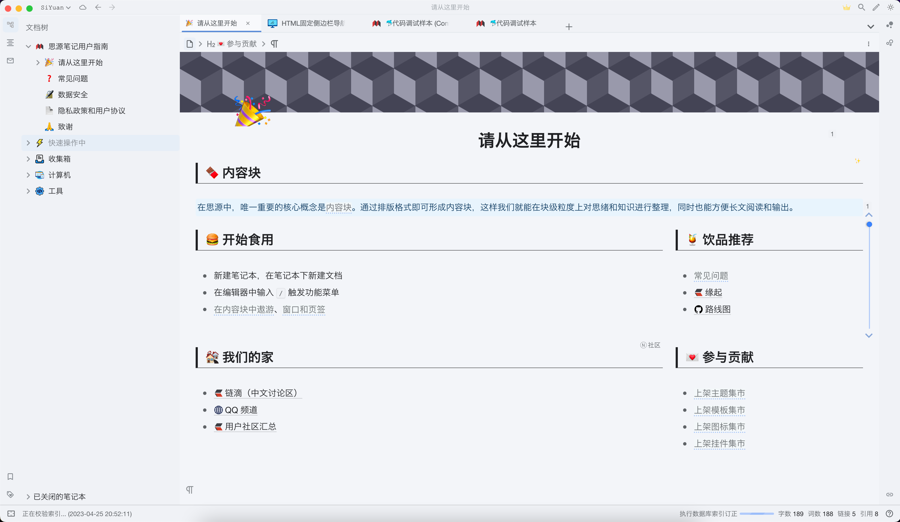
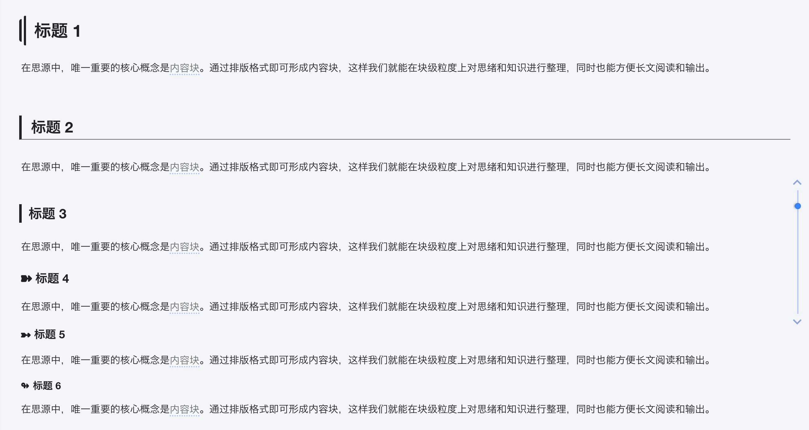
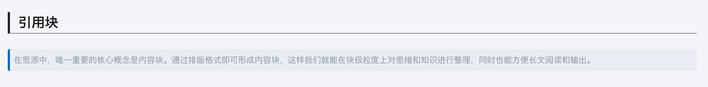
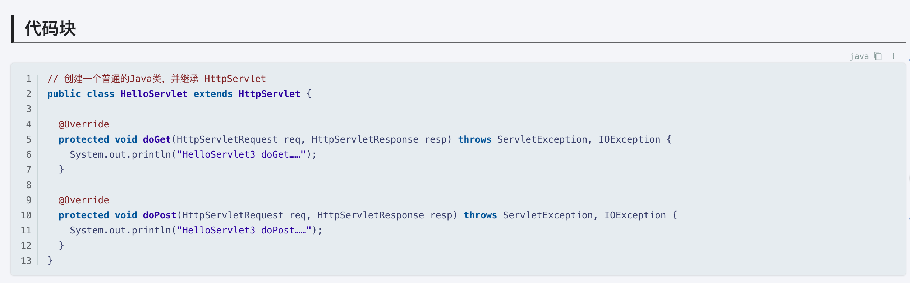
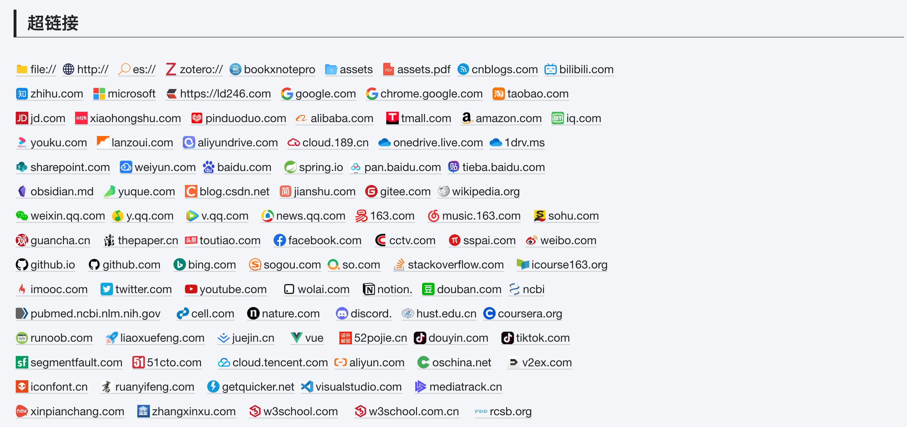

# Hazy Moonlight：A Theme for SiYuan

## Introduction

A light theme for [SiYuan](http://github.com/siyuan-note/siyuan).

[思源笔记](http://github.com/siyuan-note/siyuan)的一款浅色主题。整体采用融为一体的、朦胧、清爽的风格。

### Preview

### Titles

### Blockquote

### Code Block

### Links

## Reference

- [siyuan-gitbook-azure](https://github.com/yuuuxt/siyuan-gitbook-azure)
- [siyuan-themes-tsundoku-light](https://github.com/Achuan-2/siyuan-themes-tsundoku-light)
