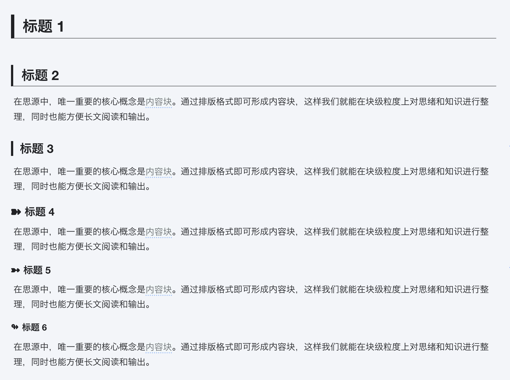

# Hazy Moonlight：A Theme for SiYuan

## Introduction

A light theme for [SiYuan](http://github.com/siyuan-note/siyuan).

### Note

下面展示的尽量是最新代码的样式。已发布的 lastest 版本并不一定是最新代码。

为了尽量在短的时间内实现所要的效果，代码有时候会比较混乱和随便，请谅解。

2023-04-28：最新修改较多，但未经全面测试，所以很可能会有 bug 存在。

### Preview

整体采用融为一体的、朦胧、清爽的风格。

布局紧凑，顶部的工具栏、左右 dock、底部状态栏均收窄，并将编辑区标签页提到顶部工具栏位置，尽量增加中间区域空间。

### Titles

易于区分的各级标题，一眼即可看出是哪一级标题

### Code Block

收窄上下边距，当只有一行代码时，不至于占用太大空间，更美观。收窄后，将代码语言和复制与更多按钮挪到上方，不至于在第一行很长时遮挡到代码。

始终显示代码语言，方便查看代码语言。行号最多支持到 3 位数。

### Blockquote

### Table

### Font Color

注：随时会调整

### Background Color

将字体背景色添加了边距和圆角，这样看起来好看些。

最后一种背景色，可以用作将某些文字遮盖。

注：随时会调整

### Font Color

### 字体颜色选择框

将字体颜色方框改为显示背景色，而非带颜色的 A，因为显示为背景色各颜色的区分看起来明显一些。

将字体背景色方框改为圆角的，以跟字体颜色方框相区分。

### Links

直观显示链接来源

