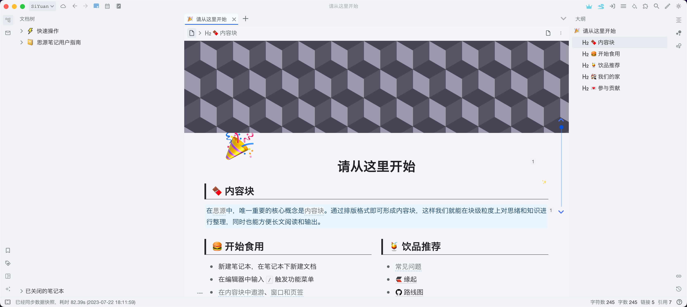
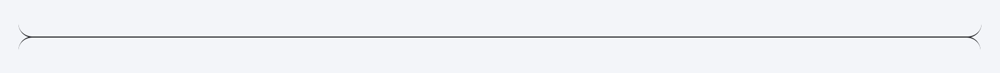

# Hazy Moonlight：A Theme for SiYuan

## Introduction

A light theme for [SiYuan](http://github.com/siyuan-note/siyuan).

[SiYuan](http://github.com/siyuan-note/siyuan) 笔记的浅色主题。

### Note

已发布的 lastest 版本并不一定是最新代码。

为了尽量在短的时间内实现所要的效果，代码有时候会比较混乱，请谅解。

未经全面测试，所以很可能会有 bug 存在，欢迎提 bug。

### Preview

下面展示的尽量是最新代码的样式。

整体采用融为一体的、朦胧、清爽的风格。

布局紧凑，顶部的工具栏、左右 dock、底部状态栏均收窄。

### 标题

易于区分的各级标题，一眼即可看出是哪一级标题。

### 代码块

收窄上下边距，当只有一行代码时，不至于占用太大空间，更美观。收窄后，将代码语言和复制与更多按钮挪到上方，不至于在第一行很长时遮挡到代码。

始终显示代码语言，方便查看代码语言。行号最多支持到 3 位数。

### 引用块

### 表格

### 字体颜色

注：颜色可能随时调整

### 背景色

将字体背景色添加了边距和圆角，这样看起来好看些。

最后一种背景色，可以用作将某些文字遮盖。

注：颜色可能随时调整

### 外观

将“字体颜色”方框改为显示背景色，而非带颜色的 A，因为显示为背景色各颜色的区分看起来明显一些。“颜色”选项不修改，以作区分。

将字体背景色方框改为圆角的，以跟字体颜色方框相区分。

### 链接

直观显示链接来源。

### 横线

