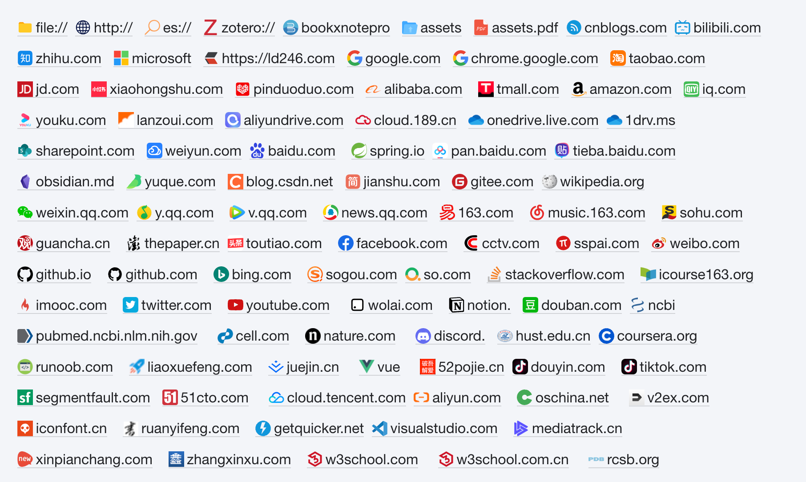

# Hazy Moonlight：A Theme for SiYuan

## Introduction

A light theme for [SiYuan](http://github.com/siyuan-note/siyuan).

[思源笔记](http://github.com/siyuan-note/siyuan)的浅色主题。

### Preview

整体采用融为一体的、朦胧、清爽的风格。

### Titles

易于区分的各级标题，一眼即可看出是哪一级标题

### Code Block

收窄上下边距，当只有一行代码时，不至于占用太大空间，更美观。收窄后，将代码语言和复制与更多按钮挪到上方，不至于在第一行很长时遮挡到代码。

始终显示代码语言，方便查看代码语言。

行号最多支持到 3 位数。

### Blockquote

### Table

### Links

直观显示链接来源

## Reference

- [siyuan-gitbook-azure](https://github.com/yuuuxt/siyuan-gitbook-azure)
- [siyuan-themes-tsundoku-light](https://github.com/Achuan-2/siyuan-themes-tsundoku-light)
